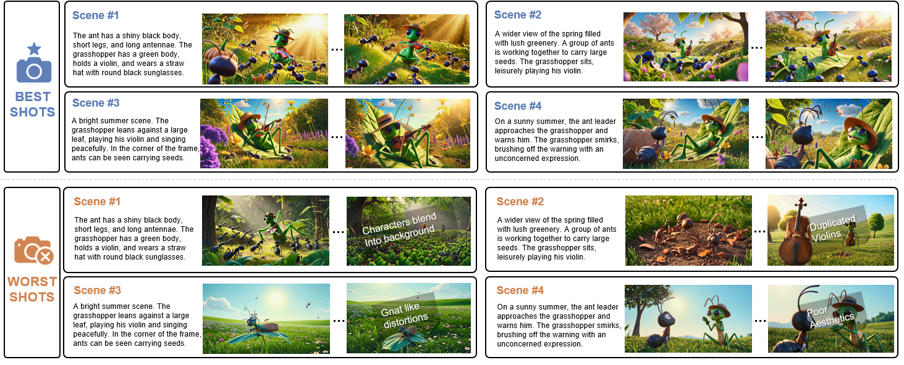
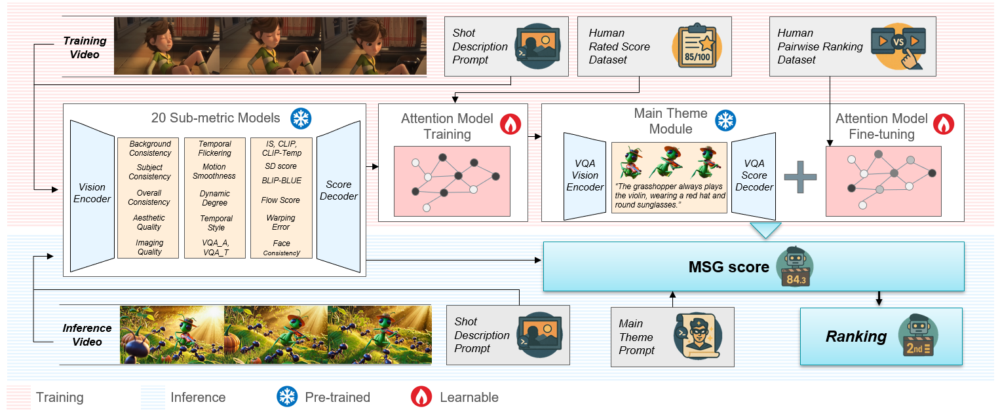

# MSG: Benchmarking Multi-Scene Video Generation for Scalable Long-Form Content

<p align="center">
  
</p>

<p align="center">
  
</p>

<h2 align="center">
  <a href="https://anonymous-paper-review.github.io/MSGscore/">Project Page</a>
</h2>

## Usage

### 1. Environment Setup

To set up the environment, run the following command:

```bash
bash setup.sh
```

This script performs the following tasks:
- Creates conda environments for VBench and EvalCrafter
- Installs necessary dependencies
- Compiles RAFT networks
- Downloads required model weights

### 2. Video Evaluation

To evaluate your generated videos, run:

```bash
bash evaluate.sh
```

This script performs the following tasks:
- Generates prompts
- Runs EvalCrafter evaluation (IS, VQA, CLIP-Score, Face Consistency, SD-Score, etc.)
- Runs VBench evaluation (subject_consistency, background_consistency, temporal_flickering, etc.)
- Calculates MSG score and saves results

Evaluation results will be stored in the configured result directory.