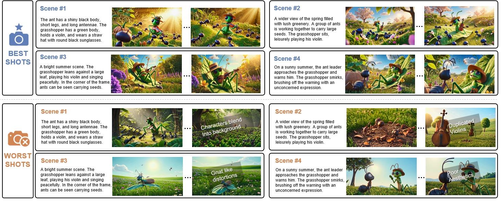
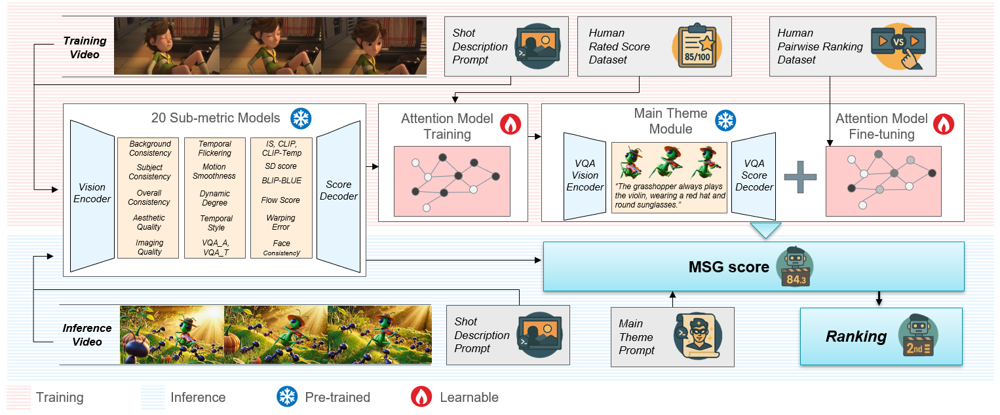

# MSG: Benchmarking Multi-Scene Video Generation for Scalable Long-Form Content

<p align="center">
  
</p>

<p align="center">
  
</p>

<h1 align="center">
  <a style = "font-size:80px;" href="https://anonymous-paper-review.github.io/MSGscore/" target="_blank8"> >> Project Page << </a>
</h1> 
## 🏗️ Overall Framework & Workflow

This repository handles **Step 4: Video Evaluation** of the overall video generation and evaluation framework. The overall system works as follows:

### System Flowchart

```mermaid
graph TD
    A[User Input] -->|Topic & Style| B(Prompt Generation)
    B --> C[Video Generation APIs]
    C -->|Candidate Videos| D{Evaluation Module<br/>(Current Repo)}
    
    style D fill:#f96,stroke:#333,stroke-width:4px
    
    D -->|Score Analysis| E{Threshold Check}
    
    E -- Pass --> F[Final Video Selection]
    E -- Fail --> G[Feedback Generation]
    G -->|Refined Parameters| B

```

## Usage

### 1. Environment Setup

To set up the environment, run the following command:

```bash
bash setup.sh
```

This script performs the following tasks:
- Creates conda environments for VBench and EvalCrafter
- Installs necessary dependencies
- Compiles RAFT networks
- Downloads required model weights

### 2. Video Evaluation

To evaluate your generated videos, run:

```bash
bash evaluate.sh
```

This script performs the following tasks:
- Generates prompts
- Runs EvalCrafter evaluation (IS, VQA, CLIP-Score, Face Consistency, SD-Score, etc.)
- Runs VBench evaluation (subject_consistency, background_consistency, temporal_flickering, etc.)
- Calculates MSG score and saves results

Evaluation results will be stored in the configured result directory.
