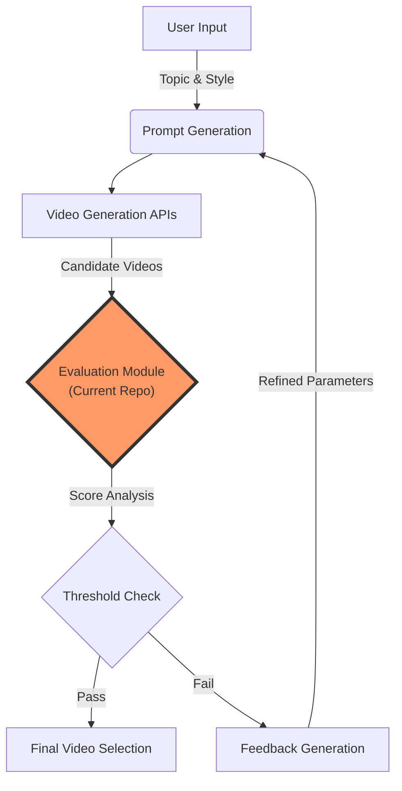

# MSG: Benchmarking Multi-Scene Video Generation for Scalable Long-Form Content

<p align="center">
  
</p>

<p align="center">
  
</p>

<h1 align="center">
  <a style = "font-size:80px;" href="https://anonymous-paper-review.github.io/MSGscore/" target="_blank8"> >> Project Page << </a>
</h1> 


## 🔄 Overall Framework Workflow

1.  **User Input**
    * The system receives the user's intent, including the desired topic, style, and concept for the video.
2.  **Prompt Generation**
    * Based on the input, the system generates optimized prompts suitable for video generation models.
3.  **Video Generation**
    * Multiple candidate videos are generated using various Video Generation APIs.
4.  **Video Evaluation**
    * **This is the core feature of this repository.**
    * The module evaluates the generated candidate videos based on human aesthetic standards and quality metrics to assign a score.
5.  **Threshold Check**
    * The system checks if the evaluation score meets a specific **Threshold**.
    * **Pass**: If the score exceeds the threshold, the video is selected as the final output.
    * **Fail**: If the score is below the threshold, the process proceeds to the feedback step.
6.  **Feedback Loop (Refinement)**
    * Based on the evaluation score and specific deficiencies identified, the system generates feedback.
    * This feedback is used to refine the prompt, and the process returns to **Step 2** to regenerate better candidates.

### System Flowchart


```mermaid
graph TD
    A[User Input] -->|Topic & Style| B(Prompt Generation)
    B --> C[Video Generation APIs]
    C -->|Candidate Videos| D{"Evaluation Module<br/>(Current Repo)"}
    
    style D fill:#f96,stroke:#333,stroke-width:4px
    
    D -->|Score Analysis| E{Threshold Check}
    
    E -- Pass --> F[Final Video Selection]
    E -- Fail --> G[Feedback Generation]
    G -->|Refined Parameters| B
```

## Usage

### 1. Environment Setup

To set up the environment, run the following command:

```bash
bash setup.sh
```

This script performs the following tasks:
- Creates conda environments for VBench and EvalCrafter
- Installs necessary dependencies
- Compiles RAFT networks
- Downloads required model weights

### 2. Video Evaluation

To evaluate your generated videos, run:

```bash
bash evaluate.sh
```

This script performs the following tasks:
- Generates prompts
- Runs EvalCrafter evaluation (IS, VQA, CLIP-Score, Face Consistency, SD-Score, etc.)
- Runs VBench evaluation (subject_consistency, background_consistency, temporal_flickering, etc.)
- Calculates MSG score and saves results

Evaluation results will be stored in the configured result directory.
